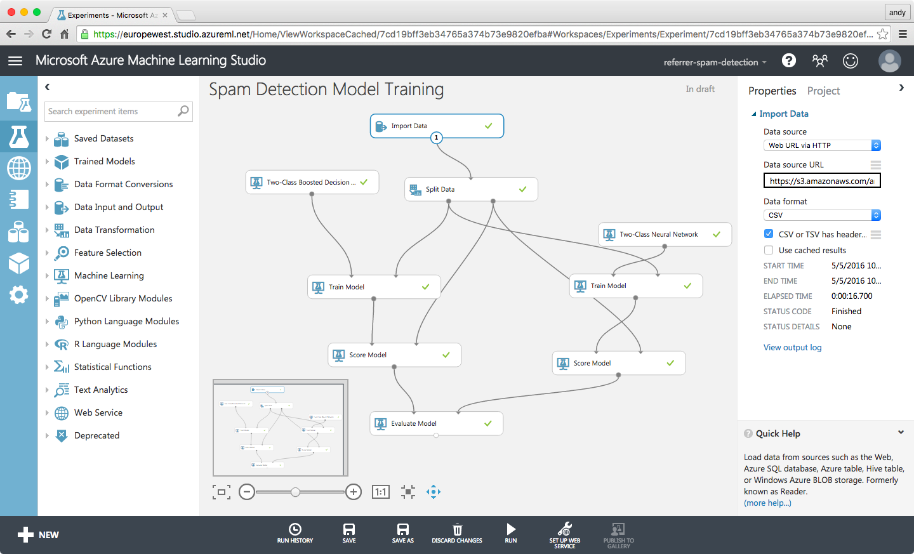

# Google Analytics Spam Control

Command-line utility for blocking referrer spam from your Google Analytics accounts automatically using the power of community-maintained lists and machine learning.

Google Analytics [referrer spam](https://en.wikipedia.org/wiki/Referer_spam) is pain.
There are hundreds of known referrer spam domains and every other day a new one pops up. And the only way to keep the spammers from skewing your web analytics reports is to block these spam domain names one by one.

**ga-spam-control** is a small command-line utility that keeps your Google Analytics spam filters up-to-date, automatically.

## How does ga-spam-control work?

**ga-spam-control** creates filters for your Google Analytics accounts that block known referrer spam domains from your analytics reports and keeps these filter up-to-date.

To always protect your analytics reports from annoying false entries ga-spam-control **combines multiple community-maintained lists** of known spam domains:

- [ddofborgs' Analytics Ghost Spam List](https://github.com/ddofborg/analytics-ghost-spam-list)
- [Stevie Rays'  apache-nginx-referral-spam-blacklist](https://github.com/Stevie-Ray/apache-nginx-referral-spam-blacklist)
- [Piwik Referrer spam blacklist](https://github.com/piwik/referrer-spam-blacklist)

with the **power of machine learning**. ga-spam-control analyzes your analytics data and identifies spam which went past the existing filters.

**Screenshot of the Azure Machine Learning Web Service that ga-spam-control uses**



This gives you the ability to completely automate your spam protection process. Just let ga-spam-control check your Google Analytics accounts daily for new spam. And when it detects new spam; update your filters.

This gives you an additional level of protection; just in case the community spam lists are not updated fast enough.

## Available Commands

The command line utility provides the following actions.

**Spam Control Filter Actions**

In order to protect your Google Analytics account from spam **ga-spam-control** creates filters which blocks known referrer spam domains from your analytics reports. These are the commands that help you to review and update your spam filters:

1. Action: **show-status**
Display the spam-control status of all your accounts or for a specific account
2. Action: **update-filters**
Create or update the spam-control filters for a specific account
3. Action: **remove-fiters**
Remove all spam-control filters from an account

**Referrer Spam Domains Actions**

The basis for the spam filters is an up-to-date list of known referrer spam domains. And with these commands you can review and update the spam-domain lists:

1. Action: **list-spam-domains**
Print a list of all currently known referrer spam domains
2. Action: **update-spam-domains**
Update the list of referrer spam domain names.
4. Action: **find-spam-domains**
Use a machine learning service to analyze the last `n` days of analytics data for new referrer spam.

The current list of referrer spam domains is stored at this path: `~/.ga-spam-control/domains`

## Usage

```bash
ga-spam-control <command> [<args> ...]
```

### Print help information

```bash
ga-spam-control --help
```

### Display spam-control status

Display the current spam-control **show-status** for all accounts that you have access to:

```bash
ga-spam-control show-status
```

Display the spam-control status in a parseable format:

```bash
ga-spam-control show-status --quiet
```

Print account IDs of accounts that have the spam-control status of "not-installed"

```bash
ga-spam-control show-status -q | grep "not-installed" | awk '{print $1}'
```

Display the current spam-control **status** for a specific Google Analytics account:

```bash
ga-spam-control show-status <accountID>
```

### Install or update spam-control filters

**update** the spam-control filters for a specific Google Analytics account:

```bash
ga-spam-control update-filters <accountID>
```

### Uninstall spam-control filters

**remove** the spam-control filters for a specific Google Analytics account:

```bash
ga-spam-control remove-filters <accountID>
```

### Find new referrer spam with machine learning

The **find-spam-domains** action analyzes the last `n ` days of analytics data from the given account for new referrer spam:

```bash
ga-spam-control find-spam-domains <accountID>
```

**Authentication**

The first time you perform an action, you will be displayed an oAuth authorization dialog.
If you permit the requested rights the authentication token will be stored in your home directory (`~/.ga-spam-control/credentials`).

To sign out you can either delete the file or de-authorize the "Google Analytics Spam Control" app in your Google App Permissions at https://security.google.com/settings/security/permissions.

## Installation

The command-line package is [github.com/andreaskoch/ga-spam-control/cli](cli/main.go). You can clone the repository or install it with `go get github.com/andreaskoch/ga-spam-control` and then run the [make.go](make.go) script:

```bash
go run make.go -test
go run make.go -install
go run make.go -crosscompile
```

Or with **make**:

```
make test
make install
make crosscompile
```

## Licensing

ga-spam-control is licensed under the Apache License, Version 2.0.
See [LICENSE](LICENSE) for the full license text.

## Related Resources

### Referrer Spam

- [What is referrer spam?](https://en.wikipedia.org/wiki/Referer_spam)

### Lists of Referrer Spam Domains

There are multiple curated lists of referrer spam domains out there that you can use to create filters for your analytics accounts.

- [Analytics Ghost Spam List](https://github.com/ddofborg/analytics-ghost-spam-list)
- [Stevie Ray: apache-nginx-referral-spam-blacklist](https://github.com/Stevie-Ray/apache-nginx-referral-spam-blacklist)
- [Piwik Referrer spam blacklist](https://github.com/piwik/referrer-spam-blacklist)
- [Referrer Spam Blocker Blacklist](https://referrerspamblocker.com/blacklist)
- [My own list of referral spam domains](spam-domains/referrer-spam-domains.txt)

### Other Spam Blocker Tools

ga-spam-control is not the first and not the only tool that helps you to block referrer spam from your Google Analytics accounts.

- [Online Tool: Analytics Referrer/Ghost Spam Blocker](https://www.adwordsrobot.com/en/tools/ga-referrer-spam-killer)
- [Spam Filter Installer](http://www.simoahava.com/spamfilter/)
- [Referrer Spam Blocker](https://referrerspamblocker.com/)

### Google Analytics: Segments

Filters **prevent** referrer spam from getting into your Google Analytics accounts.
But filters don't help you with referrer spam that already reached your reports. In order to filter this spam out you can use segments that filter out the spammy traffic:

- [Analytics Spam Blocker ](https://www.google.com/analytics/gallery/#posts/search/%3F_.tab%3DMy%26_.sort%3DDATE%26_.start%3D0%26_.viewId%3DgyNgK6N3R6iK-UphdU8M6w/)

### Google Analytics: Bot and Spider Filtering

Google Analytics has a setting to block bots and spiders from your Google Analytics reports.

1. Goto `Google Analytics > Admin > Account > Property > View > View Settings`
2. Goto `Bot Filtering`
3. Check `Exclude all hits from known bots and spiders`

This feature is not advertised much by Google. The only time it officially got mentioned by is in a Google Plus post: [Google Analytics - Introducing Bot and Spider Filtering](https://plus.google.com/+GoogleAnalytics/posts/2tJ79CkfnZk).

I am not yet sure if this flag does the trick. One would assume that is would be easy for Google to exclude all referrer spam and block the stupid spammers once and for all.

### Google Analytics: API

- [Google Analytics Account API](https://developers.google.com/analytics/devguides/config/mgmt/v3/mgmtReference/management/accounts/list)
- [Google Analytics Filter API](https://developers.google.com/analytics/devguides/config/mgmt/v3/mgmtReference/management/filters)
- [Google Analytics Filter Expressions](https://developers.google.com/analytics/devguides/reporting/core/v3/reference#filters)
- [Google Analytics Data Management](https://developers.google.com/analytics/devguides/config/mgmt/v3/data-management)
- [Google Analytics Profile Filter Links](https://developers.google.com/analytics/devguides/config/mgmt/v3/mgmtReference/management/profileFilterLinks)
